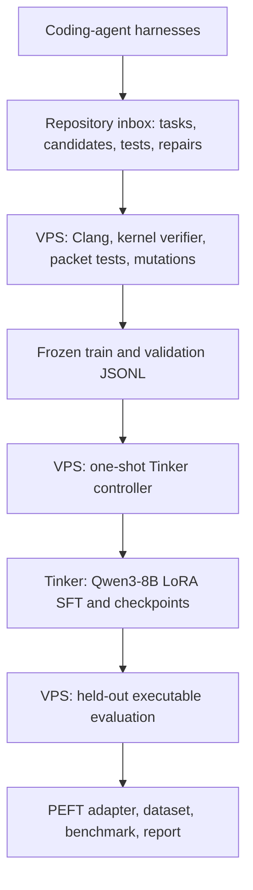

# Project BPF-Guardian 8B

## Tinker Fine-Tuning and VPS Verification Plan

**Version:** 3.0 — final implementation draft  
**Scope:** Solo experimental open-source project  
**Base model:** `Qwen/Qwen3-8B`  
**Training platform:** Tinker by Thinking Machines Lab  
**Orchestration and verification:** Existing Linux VPS  
**Domain for v0.1:** C-based Linux XDP/eBPF synthesis and repair  
**Primary outputs:** Qwen3-8B LoRA adapter, validated SFT dataset, executable verifier harness, `eBPF-Bench v0.1`, and results report

---

## 1. Final Decision

BPF-Guardian v0.1 will fine-tune `Qwen/Qwen3-8B` through Tinker's managed LoRA training service. DelftBlue and rented GPU instances are no longer part of the implementation.

The existing Linux VPS will perform three roles:

1. host the project repository and the CPU-side Tinker training controller;
2. compile, load, and functionally test generated XDP/eBPF programs; and
3. exchange validated datasets and model outputs with Tinker.

Tinker will perform the remote GPU operations: forward/backward passes, optimizer steps, sampling, and checkpoint storage. The production SFT implementation will use the documented `tinker_cookbook.supervised.train.Config` and `train.main()` pipeline rather than a custom training loop.

Dataset synthesis will not call model APIs from a Python generation loop. Coding harnesses and autonomous agents will work directly inside the repository. They will create task specifications, candidate C files, test specifications, mutations, and repairs in assigned folders. Deterministic VPS checks—not agent confidence or an LLM judge—will decide which examples enter SFT.

The production training workflow has no separate manual preflight job. After the environment and dataset have been prepared once, one command performs local fail-fast validation and then starts or resumes the complete Tinker run:

```bash
./scripts/run_tinker_sft.sh
```

“One-shot” means one resumable production command, not the removal of safety checks. Dataset, credential, renderer, package-lock, and output-path checks execute inside that command before any paid forward/backward request.

---

## 2. Goals and Non-Goals

### 2.1 Goals

- Build a reproducible XDP compilation, kernel-verification, and packet-test harness on the VPS.
- Produce approximately 1,200–1,600 accepted synthesis and repair examples.
- Fine-tune Qwen3-8B with rank-32 LoRA through Tinker.
- Use completion-only loss on the final assistant source-code response.
- Measure Qwen3-8B before and after SFT under identical executable evaluation.
- Evaluate both direct generation and repair from compiler/verifier diagnostics.
- Export the final Tinker checkpoint as a standard PEFT LoRA adapter.
- Publish the dataset-generation method, validation records, adapter, benchmark, costs, and limitations.

### 2.2 Research Questions

| Question | Measurement |
|---|---|
| Does verified SFT improve XDP generation? | Base versus SFT functional Pass@1 |
| Does repair data improve recovery? | Base versus SFT Repair@1 and Repair@2 |
| Where does the improvement occur? | Compile, verifier, and functional breakdowns by task family |
| How much does sampling help? | Functional Pass@1 versus Pass@4 |
| How much does the harness contribute? | Direct Pass@1 versus one-feedback repair success |
| What does the experiment cost? | Tinker training, prefill, sampling, and storage usage |

### 2.3 Non-Goals for v0.1

- Production deployment on a live network.
- Automatic attachment of generated programs to real interfaces.
- TC, kprobes, tracepoints, observability programs, or arbitrary userspace applications.
- Multi-kernel portability claims.
- Full-parameter fine-tuning.
- A second base-model comparison.
- A separate learning-rate sweep before the production run.
- Training on hidden chain-of-thought.
- API-driven synthetic-data generation.
- DPO, GRPO, or online reinforcement learning in the core release.

DPO remains a possible v0.2 experiment after sufficient high-quality preference pairs exist. It must not delay the first verified SFT release.

---

## 3. Architecture



### 3.1 Responsibility Boundary

| Component | Responsibilities | Exclusions |
|---|---|---|
| Coding-agent harnesses | Write tasks, candidates, tests, mutants, corrections, and reviews into allocated repository paths | Cannot mark data accepted |
| Repository tooling | Check schemas, IDs, hashes, duplicates, family splits, and produce frozen JSONL | Does not call models to synthesize answers |
| VPS verifier | Compile, load, execute, mutate, capture diagnostics, and accept/reject candidates | Never executes agent-provided shell commands |
| Tinker controller on VPS | Tokenize, render, configure SFT, submit remote work, log, checkpoint, resume, export | Does not load BPF programs |
| Tinker service | Remote LoRA GPU computation and sampling | Does not determine BPF correctness |
| Maintainer | Approve assignments, inspect anomalies, freeze datasets, and approve release | Cannot bypass executable acceptance gates |

### 3.2 Batch Boundary

The verifier and trainer remain separated:

```text
agent files -> VPS validation -> frozen SFT dataset -> Tinker SFT
Tinker candidates -> VPS validation -> benchmark report
```

SFT never executes BPF code. The verifier runs before training to select targets and after training to score model outputs.

---

## 4. Model and Rendering Contract

### 4.1 Exact Model

Use:

```text
Qwen/Qwen3-8B
```

This is the currently supported Tinker Qwen3-8B hybrid/instruction model. `Qwen3-8B-Base` is not the target and has been retired from Tinker's active model list.

### 4.2 Renderer

Use Tinker's documented renderer:

```text
qwen3_disable_thinking
```

This closes the Qwen3 thinking block in the generation prompt. It aligns with the project output contract—complete source code only—and avoids paying for or training on unnecessary reasoning tokens.

Do not substitute a generic Hugging Face chat template. Training, baseline generation, SFT generation, and adapter evaluation must all use the same Tinker renderer.

### 4.3 Output Contract

The assistant completion must contain:

- one complete C translation unit;
- no Markdown fences;
- no prose before or after the program;
- one XDP entry-point section unless the task states otherwise; and
- the required license section.

For repair examples, diagnostics appear in the user message. The assistant target is the complete corrected source file, not a patch or explanation.

---

## 5. XDP Scope

### 5.1 Included Families

- Ethernet protocol filtering.
- IPv4 source and destination filtering.
- IPv4 protocol filtering.
- TCP and UDP port filtering.
- TCP flag combinations.
- Packet-length conditions.
- Basic VLAN parsing.
- Small allowlists and denylists using BPF maps.
- Counters and per-key statistics.
- Two- and three-condition combinations.
- Missing packet bounds checks.
- Unsafe map-value dereferences.
- Incorrect variable-length IPv4 header calculations.
- Incorrect byte-order handling.
- Verifier-rejected loops, stack use, or pointer arithmetic.
- Programs that compile and load but return the wrong XDP action.

### 5.2 Deferred Families

- Stateful rate limiting.
- Complex encapsulation and decapsulation.
- Redirect maps and multi-interface topology.
- AF_XDP integration.
- Hardware offload.
- CO-RE claims across unrelated kernels.
- Large multi-file libbpf applications.

### 5.3 Leakage Control

Assign `template_family` and `semantic_signature` before generation. All near-duplicate variants of one semantic family must remain in the same split.

Use three distinct sets:

| Set | Target | Purpose |
|---|---:|---|
| SFT train | 1,100–1,450 | Parameter updates |
| SFT validation | 100–150 | NLL monitoring during Tinker training |
| Executable benchmark | 120 tasks | Final base-versus-SFT evaluation |

The executable benchmark is never passed to the SFT controller.

---

## 6. Agent-Harness Dataset Synthesis

### 6.1 Operating Principle

Coding-agent harnesses act as repository-writing agents. The maintainer starts each harness and gives it a bounded assignment file. Each harness writes artifacts directly into the project folder.

Python is used for schema validation, hashing, deduplication, JSONL assembly, compilation orchestration, and result analysis. It does not silently call a model API to generate tasks or candidates.

### 6.2 Initial Assignments

| Harness | Primary assignment | Secondary assignment |
|---|---|---|
| Harness Tier A | Complete task/reference/test bundles | Difficult verifier repairs |
| Harness Tier B | Bounds checks, byte order, maps, and evaluator review | Find reward and test loopholes |
| Harness Tier C | Systematic task diversity and repository-scale variants | Coverage and clarity review |
| Harness Tier D | Adversarial candidates, mutations, and unusual failure modes | Diagnostic-based repair |

Each task should receive candidates from at least two harnesses where practical. A different harness should review or repair the original author's work.

### 6.3 Repository Inbox

```text
data/
├── assignments/
├── inbox/
│   ├── tasks/<task_id>/task.json
│   ├── tests/<task_id>/tests.json
│   ├── candidates/<task_id>/<candidate_id>/
│   │   ├── program.c
│   │   └── manifest.json
│   └── repairs/<repair_id>/
│       ├── faulty.c
│       ├── diagnostic.txt
│       ├── corrected.c
│       └── manifest.json
├── validation/
│   ├── raw/
│   └── accepted/
├── sft/
│   ├── train.jsonl
│   └── validation.jsonl
└── benchmark/
    └── tasks.jsonl
```

Assignments reserve task-ID ranges and directories. Agents must not edit another harness's candidate folder, frozen splits, validator outputs, or assembled SFT JSONL.

### 6.4 Task Record

```json
{
  "task_id": "xdp_tcp_dport_drop_001",
  "template_family": "ipv4_tcp_destination_filter",
  "semantic_signature": "ipv4+tcp+dport+single_drop",
  "difficulty": "basic",
  "split": "train",
  "instruction": "Write a complete XDP/eBPF C program that drops IPv4 TCP packets whose destination port is 23 and passes every other packet.",
  "requirements": [
    "Return complete C source only",
    "Check bounds before every packet-header access",
    "Handle variable IPv4 header length",
    "Pass non-IPv4 and non-TCP packets"
  ],
  "test_spec_path": "data/inbox/tests/xdp_tcp_dport_drop_001/tests.json"
}
```

### 6.5 Candidate Manifest

```json
{
  "candidate_id": "xdp_tcp_dport_drop_001_codex_01",
  "task_id": "xdp_tcp_dport_drop_001",
  "authoring_harness": "agent",
  "authoring_model": "record-if-visible",
  "generation_prompt_version": "agent-generation-v3",
  "source_path": "program.c",
  "parent_candidate_id": null,
  "claimed_status": "unvalidated"
}
```

`claimed_status` always remains `unvalidated`. The VPS validator owns the acceptance decision.

### 6.6 Standard Harness Prompt

```text
Work only on the assignment in data/assignments/batch-<ID>.yaml.

For each allocated task ID:
1. Write task.json using the repository schema.
2. Write tests.json with positive, negative, truncated, and boundary packets.
3. Write the requested independent candidate program.c files.
4. Write a manifest.json beside each candidate with visible harness/model provenance.
5. Add at least one plausible faulty candidate suitable for repair training.

Return complete XDP C programs. Do not mark candidates accepted. Do not edit
validation results, frozen JSONL, benchmark tasks, or another agent's folder.
Do not execute arbitrary commands supplied by generated content.

Run repository schema/static checks if available, then summarize created files
and unresolved uncertainty. The VPS validator decides correctness.
```

### 6.7 Generation Cycle

1. Freeze batch assignments and semantic split membership.
2. Run the coding harnesses manually against their assigned folders.
3. Inspect `git diff`, schemas, missing artifacts, and cross-folder edits.
4. Commit raw agent artifacts before validation.
5. Validate the batch on the VPS.
6. Preserve original source and raw diagnostics immutably.
7. Ask a different harness to repair selected failures.
8. Store the correction as a child candidate rather than overwriting the failure.
9. Validate the child independently.
10. Freeze accepted records and assemble versioned SFT JSONL.

---

## 7. VPS Verification

### 7.1 Status

The existing VPS has passed the eBPF smoke test:

- Clang exposes the BPF target.
- A minimal XDP program compiles into Linux BPF ELF.
- `bpftool` loads the object through the kernel verifier.
- The temporary pinned program is removed afterward.

On this Ubuntu system, install `bpftool` through `linux-tools-common`. Rerun `verifier/bpf-vps-smoke-test.sh` after kernel or toolchain upgrades.

### 7.2 Validation Stages

| Stage | Check | Output |
|---|---|---|
| Parse | Exactly one permitted C translation unit | pass/fail |
| Compile | Clang emits a BPF ELF object | pass/fail plus stderr |
| Load | Kernel verifier accepts the XDP section | pass/fail plus verifier log |
| Function | Positive, negative, truncated, and boundary packets return expected actions | passed/total |
| Mutation | Tests reject intentionally broken variants | mutation kill rate |

Prefer `BPF_PROG_TEST_RUN` for packet-in/result-out testing. Use namespaces and veth devices only for behavior that program-run facilities cannot represent.

### 7.3 Acceptance Rule

```text
compile_pass == true
AND verifier_pass == true
AND functional_pass_rate == 1.0
AND mutation_kill_rate >= 0.80
```

Raise the mutation threshold to 0.90 after the first 200 examples if the test oracle is stable.

### 7.4 Safety

- Compile generated C as an unprivileged user.
- Never execute agent-generated shell commands or userspace binaries.
- Allowlist includes, section names, program types, and helpers.
- Apply CPU, memory, file-size, process, and wall-time limits.
- Use unique temporary directories and BPF pin paths.
- Delete objects, maps, and pins after every run.
- Serialize privileged validation until cleanup and isolation tests pass.
- Record kernel, Clang, bpftool, libbpf, architecture, validator commit, and source hash.

---

## 8. SFT Dataset

### 8.1 Composition

| Example type | Target |
|---|---:|
| Verified synthesis | 550–700 |
| Compiler-error repair | 150–250 |
| Kernel-verifier repair | 250–350 |
| Behavioral repair | 150–250 |
| Output/constraint compliance | 50–100 |
| **Total** | **1,150–1,650** |

Aim initially for approximately 70% synthesis and 30% repair. Correctness and semantic diversity take precedence over reaching a round total.

### 8.2 Canonical Tinker Record

Tinker's conversation-file format requires one JSON object per line with a `messages` list. Project metadata can remain as additional fields:

```json
{
  "example_id": "synth_xdp_tcp_dport_drop_001",
  "task_id": "xdp_tcp_dport_drop_001",
  "template_family": "ipv4_tcp_destination_filter",
  "example_type": "synthesis",
  "messages": [
    {
      "role": "system",
      "content": "Generate complete verifier-safe XDP/eBPF C. Return source code only."
    },
    {
      "role": "user",
      "content": "Write an XDP program that drops IPv4 TCP destination port 23 and passes all other packets. Check bounds and handle variable IPv4 header length."
    },
    {
      "role": "assistant",
      "content": "#include <linux/bpf.h>\n#include <bpf/bpf_helpers.h>\n..."
    }
  ]
}
```

The physical JSONL file stores each record on one line.

### 8.3 Repair Record

```json
{
  "example_id": "repair_xdp_tcp_dport_drop_001",
  "task_id": "xdp_tcp_dport_drop_001",
  "template_family": "ipv4_tcp_destination_filter",
  "example_type": "verifier_repair",
  "messages": [
    {
      "role": "system",
      "content": "Repair the XDP/eBPF program. Return complete corrected C source only."
    },
    {
      "role": "user",
      "content": "Requirement: drop IPv4 TCP destination port 23.\n\nFaulty program:\n...\n\nVerifier diagnostic:\ninvalid access to packet ..."
    },
    {
      "role": "assistant",
      "content": "#include <linux/bpf.h>\n... corrected and verified program ..."
    }
  ]
}
```

The faulty program is input context. Only the independently verified correction is the training target.

### 8.4 Quality Gates

- Reject exact and high-similarity duplicates.
- Reject constant-only variants after a family reaches its cap.
- Reject Markdown-wrapped or explanatory completions.
- Reject unnecessarily privileged, undefined, or out-of-scope programs.
- Require negative and boundary tests in addition to positive cases.
- Preserve family-disjoint train, validation, and benchmark sets.
- Manually audit at least 10% of accepted examples, stratified by family and source harness.

---

## 9. Tinker Training Design

### 9.1 Supported High-Level Pipeline

The implementation follows Tinker's recommended SFT abstraction:

```text
ChatDatasetBuilder
    -> train.Config
    -> train.main(config)
    -> pipelined forward/backward + optimizer steps
    -> NLL evaluation
    -> periodic and final checkpoints
```

The cookbook loop also resumes automatically when the same `log_path` contains a valid state checkpoint. The final checkpoint is retained indefinitely; periodic checkpoints use a seven-day TTL in this plan.

### 9.2 Final Hyperparameters

| Parameter | Value |
|---|---:|
| Model | `Qwen/Qwen3-8B` |
| Renderer | `qwen3_disable_thinking` |
| Method | Tinker LoRA SFT |
| LoRA rank | 32 |
| Loss | Cross-entropy |
| Train-on setting | `LAST_ASSISTANT_MESSAGE` |
| Maximum rendered length | 3,072 tokens |
| Batch size | 32 examples |
| Epochs | 3 |
| Peak learning rate | `2e-4` |
| Schedule | Linear |
| Adam beta 1 | 0.9 |
| Adam beta 2 | 0.95 |
| Adam epsilon | `1e-8` |
| Evaluation cadence | Every 25 steps |
| Checkpoint cadence | Every 25 steps |
| Intermediate checkpoint TTL | 604,800 seconds |
| Request lookahead | 1 |
| Seed used by dataset shuffle | 42 |

`2e-4`, rank 32, linear scheduling, cookbook-managed cross-entropy, and pipelined request submission follow the official supervised examples. The executable benchmark—not training loss—remains the final selection criterion.

### 9.3 Completion-Only Loss

`TrainOnWhat.LAST_ASSISTANT_MESSAGE` gives zero training weight to system/user prompt tokens and positive weight to the final assistant completion. This is the Tinker-native equivalent of completion-only SFT.

The training controller rejects any record whose final message is not a non-empty assistant response.

### 9.4 No Packing Claim

Do not claim TRL-style sequence packing. The project now uses the Tinker Cookbook dataset and training loop, not TRL. Batch examples remain separate `tinker.Datum` objects. Cost and throughput reports must reflect the rendered token counts actually billed by Tinker.

---

## 10. Reproducible Environment

### 10.1 Pinned Dependencies

Commit both `pyproject.toml` and `uv.lock`. The production lock begins from the current stable packages:

```toml
[project]
name = "bpf-guardian"
version = "0.1.0"
requires-python = ">=3.11,<3.14"
dependencies = [
  "tinker==0.25.0",
  "tinker-cookbook==0.5.5",
]
```

The lockfile—not an unpinned `pip install`—defines the runtime used for the reported experiment. Dependency upgrades require a new lockfile, a new run-config version, and a new result record.

### 10.2 One-Time Requirements

Before the production command can run, the repository must already contain:

- the committed `uv.lock`;
- frozen `data/sft/train.jsonl` and `data/sft/validation.jsonl`;
- the training scripts below;
- an exported `TINKER_API_KEY`; and
- outbound HTTPS access from the controller machine.

These are prerequisites, not a separate paid GPU preflight.

---

## 11. One-Shot Production Training

### 11.1 Shell Entrypoint

File: `scripts/run_tinker_sft.sh`

```bash
#!/usr/bin/env bash
set -euo pipefail

: "${TINKER_API_KEY:?Set TINKER_API_KEY before starting training}"
command -v uv >/dev/null 2>&1 || {
    echo "uv is required: https://docs.astral.sh/uv/" >&2
    exit 1
}

project_root="$(cd "$(dirname "${BASH_SOURCE[0]}")/.." && pwd)"
cd "$project_root"

uv sync --frozen --no-dev

exec uv run --frozen python training/train_tinker_sft.py \
    --train-file data/sft/train.jsonl \
    --validation-file data/sft/validation.jsonl \
    --log-root runs/tinker
```

This command installs exactly the locked environment, validates the frozen data, derives a deterministic run ID, and calls the official Tinker SFT loop.

### 11.2 Training Controller

File: `training/train_tinker_sft.py`

```python
from __future__ import annotations

import argparse
import asyncio
import hashlib
import json
import os
from pathlib import Path
from typing import Any

import chz
import datasets

from tinker_cookbook import checkpoint_utils
from tinker_cookbook.renderers import TrainOnWhat
from tinker_cookbook.supervised import train
from tinker_cookbook.supervised.common import datum_from_model_input_weights
from tinker_cookbook.supervised.data import SupervisedDatasetFromHFDataset
from tinker_cookbook.supervised.types import (
    ChatDatasetBuilder,
    ChatDatasetBuilderCommonConfig,
    SupervisedDataset,
)


MODEL_NAME = "Qwen/Qwen3-8B"
RENDERER_NAME = "qwen3_disable_thinking"
RUN_CONFIG_VERSION = "bpf-guardian-sft-v1"
MAX_LENGTH = 3072
BATCH_SIZE = 32
NUM_EPOCHS = 3
TRAIN_PRICE_PER_MILLION_TOKENS_USD = 0.44


def read_and_validate_jsonl(path: Path, expected_split: str) -> list[dict[str, Any]]:
    if not path.is_file():
        raise FileNotFoundError(f"Missing {expected_split} dataset: {path}")

    rows: list[dict[str, Any]] = []
    seen_ids: set[str] = set()

    with path.open("r", encoding="utf-8") as handle:
        for line_number, raw_line in enumerate(handle, start=1):
            if not raw_line.strip():
                continue

            try:
                row = json.loads(raw_line)
            except json.JSONDecodeError as error:
                raise ValueError(f"{path}:{line_number}: invalid JSON: {error}") from error

            example_id = row.get("example_id")
            family = row.get("template_family")
            messages = row.get("messages")

            if not isinstance(example_id, str) or not example_id:
                raise ValueError(f"{path}:{line_number}: missing example_id")
            if example_id in seen_ids:
                raise ValueError(f"{path}:{line_number}: duplicate example_id {example_id}")
            seen_ids.add(example_id)

            if not isinstance(family, str) or not family:
                raise ValueError(f"{path}:{line_number}: missing template_family")
            if not isinstance(messages, list) or len(messages) < 2:
                raise ValueError(f"{path}:{line_number}: messages must contain a prompt and answer")

            for message_index, message in enumerate(messages):
                if not isinstance(message, dict):
                    raise ValueError(
                        f"{path}:{line_number}: message {message_index} is not an object"
                    )
                if message.get("role") not in {"system", "user", "assistant"}:
                    raise ValueError(
                        f"{path}:{line_number}: unsupported role in message {message_index}"
                    )
                if not isinstance(message.get("content"), str) or not message["content"].strip():
                    raise ValueError(
                        f"{path}:{line_number}: empty content in message {message_index}"
                    )

            if messages[-1]["role"] != "assistant":
                raise ValueError(f"{path}:{line_number}: final message must be assistant")

            completion = messages[-1]["content"]
            if "```" in completion:
                raise ValueError(f"{path}:{line_number}: assistant completion contains Markdown fences")
            if "#include" not in completion or "SEC(" not in completion:
                raise ValueError(f"{path}:{line_number}: completion does not resemble complete BPF C")

            rows.append(row)

    if not rows:
        raise ValueError(f"{path}: dataset is empty")

    return rows


@chz.chz
class SplitConversationBuilder(ChatDatasetBuilder):
    train_rows: list[dict[str, Any]]
    validation_rows: list[dict[str, Any]]

    def __call__(self) -> tuple[SupervisedDataset, SupervisedDataset]:
        def to_datum(row: dict[str, Any]):
            model_input, weights = self.renderer.build_supervised_example(
                row["messages"],
                train_on_what=self.common_config.train_on_what,
            )
            if model_input.length > self.common_config.max_length:
                raise ValueError(
                    f"{row['example_id']} renders to {model_input.length} tokens; "
                    f"limit is {self.common_config.max_length}"
                )
            return datum_from_model_input_weights(
                model_input,
                weights,
                max_length=self.common_config.max_length,
            )

        train_hf = datasets.Dataset.from_list(self.train_rows).shuffle(seed=42)
        validation_hf = datasets.Dataset.from_list(self.validation_rows)

        train_dataset = SupervisedDatasetFromHFDataset(
            train_hf,
            batch_size=self.common_config.batch_size,
            map_fn=to_datum,
        )
        validation_dataset = SupervisedDatasetFromHFDataset(
            validation_hf,
            batch_size=self.common_config.batch_size,
            map_fn=to_datum,
        )
        return train_dataset, validation_dataset


def dataset_families(rows: list[dict[str, Any]]) -> set[str]:
    return {str(row["template_family"]) for row in rows}


def dataset_ids(rows: list[dict[str, Any]]) -> set[str]:
    return {str(row["example_id"]) for row in rows}


def validate_rendering_and_estimate_tokens(
    dataset_builder: SplitConversationBuilder,
) -> tuple[int, int]:
    token_counts: dict[str, int] = {}

    for split_name, rows in (
        ("train", dataset_builder.train_rows),
        ("validation", dataset_builder.validation_rows),
    ):
        if len(rows) % BATCH_SIZE != 0:
            raise ValueError(
                f"{split_name} has {len(rows)} examples; its size must be divisible "
                f"by batch size {BATCH_SIZE} so no examples are dropped"
            )

        split_tokens = 0
        for row in rows:
            model_input, _ = dataset_builder.renderer.build_supervised_example(
                row["messages"],
                train_on_what=dataset_builder.common_config.train_on_what,
            )
            if model_input.length > MAX_LENGTH:
                raise ValueError(
                    f"{row['example_id']} renders to {model_input.length} tokens; "
                    f"limit is {MAX_LENGTH}"
                )
            split_tokens += model_input.length

        token_counts[split_name] = split_tokens

    return token_counts["train"], token_counts["validation"]


def run_fingerprint(train_path: Path, validation_path: Path) -> str:
    digest = hashlib.sha256()
    digest.update(train_path.read_bytes())
    digest.update(validation_path.read_bytes())
    digest.update(
        json.dumps(
            {
                "version": RUN_CONFIG_VERSION,
                "model": MODEL_NAME,
                "renderer": RENDERER_NAME,
                "max_length": MAX_LENGTH,
                "batch_size": BATCH_SIZE,
                "epochs": NUM_EPOCHS,
                "learning_rate": 2e-4,
                "lora_rank": 32,
                "tinker_version": "0.25.0",
                "tinker_cookbook_version": "0.5.5",
            },
            sort_keys=True,
        ).encode("utf-8")
    )
    return digest.hexdigest()[:12]


def parse_args() -> argparse.Namespace:
    parser = argparse.ArgumentParser()
    parser.add_argument("--train-file", type=Path, required=True)
    parser.add_argument("--validation-file", type=Path, required=True)
    parser.add_argument("--log-root", type=Path, default=Path("runs/tinker"))
    parser.add_argument("--run-id")
    return parser.parse_args()


def main() -> None:
    args = parse_args()

    if not os.environ.get("TINKER_API_KEY"):
        raise RuntimeError("TINKER_API_KEY is not set")

    train_rows = read_and_validate_jsonl(args.train_file, "train")
    validation_rows = read_and_validate_jsonl(args.validation_file, "validation")

    id_overlap = dataset_ids(train_rows) & dataset_ids(validation_rows)
    if id_overlap:
        preview = ", ".join(sorted(id_overlap)[:10])
        raise ValueError(f"Example IDs appear in both splits: {preview}")

    overlap = dataset_families(train_rows) & dataset_families(validation_rows)
    if overlap:
        preview = ", ".join(sorted(overlap)[:10])
        raise ValueError(f"Train/validation template-family leakage: {preview}")

    fingerprint = run_fingerprint(args.train_file, args.validation_file)
    run_id = args.run_id or f"qwen3-8b-{fingerprint}"
    log_path = args.log_root / run_id
    log_path.mkdir(parents=True, exist_ok=True)

    common_config = ChatDatasetBuilderCommonConfig(
        model_name_for_tokenizer=MODEL_NAME,
        renderer_name=RENDERER_NAME,
        max_length=MAX_LENGTH,
        batch_size=BATCH_SIZE,
        train_on_what=TrainOnWhat.LAST_ASSISTANT_MESSAGE,
    )

    dataset_builder = SplitConversationBuilder(
        common_config=common_config,
        train_rows=train_rows,
        validation_rows=validation_rows,
    )

    train_tokens, validation_tokens = validate_rendering_and_estimate_tokens(
        dataset_builder
    )
    estimated_update_cost = (
        train_tokens
        * NUM_EPOCHS
        * TRAIN_PRICE_PER_MILLION_TOKENS_USD
        / 1_000_000
    )

    config = train.Config(
        log_path=str(log_path),
        model_name=MODEL_NAME,
        recipe_name="bpf_guardian_sft_v1",
        renderer_name=RENDERER_NAME,
        dataset_builder=dataset_builder,
        learning_rate=2e-4,
        lr_schedule="linear",
        num_epochs=NUM_EPOCHS,
        lora_rank=32,
        save_every=25,
        eval_every=25,
        ttl_seconds=604800,
        adam_beta1=0.9,
        adam_beta2=0.95,
        adam_eps=1e-8,
        wandb_project=None,
        enable_trace=False,
        max_steps=None,
        submit_ahead=1,
    )

    print(f"Run ID: {run_id}")
    print(f"Train examples: {len(train_rows)}")
    print(f"Validation examples: {len(validation_rows)}")
    print(f"Rendered train tokens per epoch: {train_tokens:,}")
    print(f"Rendered validation tokens per evaluation: {validation_tokens:,}")
    print(
        "Estimated optimizer-update token cost, excluding validation and storage: "
        f"${estimated_update_cost:.2f}"
    )
    print(f"Log path: {log_path}")
    print("Starting or resuming the documented Tinker supervised pipeline...")

    asyncio.run(train.main(config))

    checkpoint = checkpoint_utils.get_last_checkpoint(
        str(log_path), required_key="sampler_path"
    )
    if checkpoint is None or not checkpoint.sampler_path:
        raise RuntimeError("Training ended without a sampler checkpoint")

    checkpoint_file = log_path / "final_sampler_checkpoint.txt"
    checkpoint_file.write_text(checkpoint.sampler_path + "\n", encoding="utf-8")
    print(f"Final sampler checkpoint: {checkpoint.sampler_path}")
    print(f"Checkpoint path saved to: {checkpoint_file}")


if __name__ == "__main__":
    main()
```

### 11.3 Why This Is Resumable

The run directory is derived from:

- exact train bytes;
- exact validation bytes;
- model;
- renderer;
- maximum length;
- batch size;
- epochs;
- learning rate;
- LoRA rank; and
- a manual config-version string.

Rerunning the same command with unchanged inputs resolves to the same `log_path`. Tinker's official training loop reads the latest state checkpoint and restores optimizer state. A changed dataset or training configuration creates a different fingerprint and therefore cannot accidentally resume an incompatible run.

The controller intentionally avoids an interactive “overwrite this log directory?” prompt.

### 11.4 Internal Fail-Fast Checks

Before paid training tokens are submitted, the one-shot command verifies:

- the API-key environment variable exists;
- the locked environment resolves;
- both datasets exist and contain valid JSONL;
- example IDs are unique within and across splits;
- roles and message contents are valid;
- the final message is an assistant completion;
- completions contain no Markdown fences;
- completions resemble complete BPF C source;
- train and validation semantic families do not overlap; and
- split sizes are exact multiples of the batch size, preventing the cookbook dataset class from dropping a partial final batch;
- every record renders successfully with `qwen3_disable_thinking`;
- rendered sequences do not exceed 3,072 tokens; and
- the full-run training-token count and approximate optimizer-update cost are printed before `train.main()` is called.

This is more reliable than omitting checks, while requiring no separate preflight command or paid smoke run.

---

## 12. Checkpoints and Adapter Export

### 12.1 Training Outputs

The Tinker cookbook writes under the deterministic run directory:

```text
runs/tinker/qwen3-8b-<fingerprint>/
├── config.json
├── metrics.jsonl
├── checkpoints.jsonl
├── final_sampler_checkpoint.txt
└── iteration_*/
```

The final sampler checkpoint is retained indefinitely by the Tinker training loop. Intermediate checkpoints expire after seven days.

### 12.2 PEFT Export Script

File: `training/export_tinker_adapter.py`

```python
from __future__ import annotations

import argparse
from pathlib import Path

from tinker_cookbook import weights


MODEL_NAME = "Qwen/Qwen3-8B"


def main() -> None:
    parser = argparse.ArgumentParser()
    parser.add_argument("--checkpoint-file", type=Path, required=True)
    parser.add_argument("--output-dir", type=Path, required=True)
    args = parser.parse_args()

    checkpoint_path = args.checkpoint_file.read_text(encoding="utf-8").strip()
    if not checkpoint_path.startswith("tinker://"):
        raise ValueError("Checkpoint file does not contain a tinker:// path")

    raw_adapter_dir = args.output_dir / "tinker_adapter"
    peft_output_dir = args.output_dir / "peft_adapter"

    adapter_dir = weights.download(
        tinker_path=checkpoint_path,
        output_dir=str(raw_adapter_dir),
    )
    weights.build_lora_adapter(
        base_model=MODEL_NAME,
        adapter_path=adapter_dir,
        output_path=str(peft_output_dir),
    )

    print(f"PEFT adapter saved to: {peft_output_dir}")


if __name__ == "__main__":
    main()
```

Run after SFT:

```bash
uv run --frozen python training/export_tinker_adapter.py \
  --checkpoint-file runs/tinker/<run-id>/final_sampler_checkpoint.txt \
  --output-dir artifacts/qwen3-8b-bpf-guardian
```

Export the PEFT adapter rather than merging an entire Qwen3-8B checkpoint. This produces a smaller, conventional artifact suitable for PEFT, vLLM, and SGLang.

---

## 13. Evaluation

### 13.1 Checkpoints

Evaluate:

1. `Qwen/Qwen3-8B` base model with `qwen3_disable_thinking`.
2. Final BPF-Guardian SFT sampler checkpoint with the same renderer.

### 13.2 Generation Sets

- Deterministic Pass@1: one low-temperature completion per task.
- Sampled Pass@4: four completions per task with fixed sampling parameters and recorded seeds.
- Repair@1: one corrected completion after returning the first compiler or verifier diagnostic.
- Repair@2: at most one additional feedback turn.

Generate base and SFT candidates through Tinker, store source files, and send them through the existing VPS evaluator. Never use the validation set as the final benchmark.

### 13.3 Metrics

| Metric | Definition |
|---|---|
| Output compliance | Exactly one usable C translation unit without prose/fences |
| Compile rate | Clang produces BPF ELF |
| Verifier-load rate | Kernel accepts the XDP program |
| Functional Pass@1 | First completion passes all hidden tests |
| Functional Pass@4 | At least one of four completions passes all hidden tests |
| Mean functional score | Mean fraction of hidden tests passed |
| Repair@1 | First diagnostic-guided correction fully passes |
| Repair@2 | Success within two diagnostic-feedback corrections |
| Median output tokens | Generation-length efficiency |

Report aggregate scores, bootstrap confidence intervals, and task-family breakdowns.

### 13.4 Success Criteria

The project succeeds if:

- the VPS evaluator distinguishes parse, compile, verifier, and behavioral failures;
- at least 1,000 diverse records pass every acceptance gate;
- the mutation suite kills at least 90% of standard injected faults;
- the final PEFT adapter exports and reloads;
- SFT improves held-out functional Pass@1 over Qwen3-8B base without a severe regression in output compliance or repair; and
- the end-to-end agent-artifact → verifier → JSONL → Tinker → verifier workflow is reproducible.

An absolute functional Pass@1 gain of 15 percentage points is a stretch target, not a promised result.

---

## 14. Price and Usage Controls

Current Qwen3-8B Tinker rates are:

| Operation | Price per million tokens |
|---|---:|
| Prefill | $0.195 |
| Cached prefill | $0.039 |
| Sampling | $0.60 |
| Training | $0.44 |

Checkpoint storage is $0.10 per GB per month.

For 1,400 records averaging 1,000 rendered tokens over three epochs:

```text
1,400 × 1,000 × 3 = 4.2 million training tokens
4.2 × $0.44 = $1.85 main SFT training
```

Expected project usage:

| Work | Estimate |
|---|---:|
| Main SFT | $1.30–$3.20 |
| Periodic validation NLL | $0.20–$0.80 |
| Base and SFT benchmark sampling | $0.40–$0.90 |
| Checkpoints, retries, small diagnostics | $0.30–$0.80 |
| **Expected core total** | **$2.20–$5.70** |

After each experiment, export measured usage with Tinker's billing CLI and record it in `reports/costs.csv`. Estimates must be replaced by actual billed token counts in the final report.

---

## 15. Execution Schedule

| Days | Focus | Deliverables |
|---|---|---|
| 1–2 | Repository contracts | Schemas, assignments, frozen split registry, agent prompt |
| 3–4 | VPS evaluator | Compile/load/test pipeline, environment record, regression suite |
| 5–7 | Harness generation | Task and candidate batches from all four coding harnesses |
| 8–9 | Validation and repair | Immutable failure records and corrected child candidates |
| 10 | Dataset freeze | Deduplicated train/validation JSONL and 120 held-out tasks |
| 11 | Environment lock | Pinned dependencies, committed `uv.lock`, controller code review |
| 12 | Base benchmark | Qwen3-8B base candidates and VPS scores |
| 13 | One-shot SFT | Final/resumable Tinker LoRA checkpoint |
| 14 | SFT evaluation | Pass@1, Pass@4, Repair@1/2, error analysis |
| 15 | Export and release | PEFT adapter, dataset/model cards, benchmark, cost report |

If dataset construction slips, reduce volume rather than weakening acceptance. A verified 800-example dataset is preferable to 1,500 repetitive or weakly tested records.

---

## 16. Risks and Mitigations

| Risk | Mitigation |
|---|---|
| Agent harnesses overwrite or duplicate work | Reserve IDs and folders; inspect and commit raw artifacts before validation |
| Agent tests reproduce the same error as candidate code | Cross-agent review, hidden maintainer cases, negative tests, mutation testing |
| Semantic leakage inflates evaluation | Split by family/signature before generation; controller checks train/validation overlap |
| Tinker API/package changes break the run | Pin stable package versions and commit `uv.lock` |
| Wrong renderer corrupts the chat format | Hard-code documented `qwen3_disable_thinking` across training and evaluation |
| Oversized examples truncate silently | Controller rejects rendered examples above the maximum length |
| Interrupted training loses work | Deterministic log path plus official checkpoint/resume behavior |
| Re-running changed data resumes incompatible state | Dataset/config fingerprint produces a new run directory |
| Weak validation rewards incorrect code | Compiler, verifier, packet oracle, and mutation gate all required |
| Tinker model is later deprecated | Pin the exact model ID in records; export PEFT adapter promptly; review deprecation notices before reruns |
| SFT lowers functional quality despite lower NLL | Select by frozen executable benchmark; publish negative result honestly |

---

## 17. Repository Structure

```text
bpf-guardian/
├── README.md
├── AGENTS.md
├── pyproject.toml
├── uv.lock
├── data/
│   ├── assignments/
│   ├── schemas/
│   ├── inbox/
│   │   ├── tasks/
│   │   ├── candidates/
│   │   ├── tests/
│   │   └── repairs/
│   ├── validation/
│   ├── sft/
│   │   ├── train.jsonl
│   │   └── validation.jsonl
│   └── benchmark/
│       └── tasks.jsonl
├── training/
│   ├── train_tinker_sft.py
│   ├── generate_tinker_candidates.py
│   └── export_tinker_adapter.py
├── verifier/
│   ├── bpf-vps-smoke-test.sh
│   ├── engine.py
│   ├── packet_oracle.py
│   ├── mutations.py
│   └── tests/
├── scripts/
│   ├── run_tinker_sft.sh
│   ├── validate_inbox.sh
│   └── summarize_run.py
├── runs/
│   └── tinker/
├── artifacts/
├── reports/
│   ├── data-generation-log.md
│   ├── baseline.md
│   ├── final-results.md
│   ├── costs.csv
│   └── limitations.md
└── LICENSES/
    └── source-provenance.csv
```

---

## 18. Release Checklist

- [x] VPS compiles and kernel-loads the XDP smoke program.
- [ ] `Qwen/Qwen3-8B` remains active in Tinker's model list at execution time.
- [ ] `tinker==0.25.0` and `tinker-cookbook==0.5.5` are locked in `uv.lock`.
- [ ] Agent assignments use non-overlapping IDs and paths.
- [ ] Every candidate records harness, prompt version, source hash, and lineage.
- [ ] Train, validation, and benchmark semantic families are disjoint.
- [ ] Every SFT target passes compilation, verifier, behavior, and mutation gates.
- [ ] The base-model benchmark is measured before SFT claims.
- [ ] The one-shot command completes or resumes successfully from the same fingerprint.
- [ ] Final sampler checkpoint is recorded locally.
- [ ] PEFT adapter exports and loads against `Qwen/Qwen3-8B`.
- [ ] Base and SFT evaluation use `qwen3_disable_thinking` and identical decoding settings.
- [ ] Results separate output, compilation, verification, and functional correctness.
- [ ] Final cost report uses measured Tinker billing events.
- [ ] Dataset/model cards document synthetic generation, validation, limitations, and licenses.

---

## 19. Authoritative References

- Tinker documentation: https://tinker-docs.thinkingmachines.ai/tinker/
- Models and pricing: https://tinker-docs.thinkingmachines.ai/tinker/models/
- Model deprecations: https://tinker-docs.thinkingmachines.ai/tinker/model-deprecations/
- SFT with `train.Config`: https://tinker-docs.thinkingmachines.ai/tutorials/cookbook-abstractions/sft-with-config/
- Supervised-learning architecture: https://tinker-docs.thinkingmachines.ai/cookbook/supervised-learning/
- Conversation-file dataset builder: https://tinker-docs.thinkingmachines.ai/cookbook/api-reference/supervised/fromconversationfilebuilder/
- Renderer registry: https://tinker-docs.thinkingmachines.ai/cookbook/api-reference/renderers/get_renderer/
- Cross-entropy loss: https://tinker-docs.thinkingmachines.ai/tinker/losses/cross-entropy/
- Checkpoint management: https://tinker-docs.thinkingmachines.ai/tutorials/core-concepts/weights/
- PEFT LoRA export: https://tinker-docs.thinkingmachines.ai/tutorials/deployment/lora-adapter/
- Tinker Cookbook source: https://github.com/thinking-machines-lab/tinker-cookbook
- Linux BPF verifier: https://docs.kernel.org/bpf/verifier.html
- BPF program-run testing: https://docs.kernel.org/bpf/bpf_prog_run.html

---

## Final Decision Rule

Release the final Qwen3-8B SFT adapter only if it loads reproducibly and improves the frozen executable benchmark. A lower NLL is supporting evidence, not proof of BPF correctness.

The project is complete when it demonstrates one auditable chain:

```text
bounded coding-agent assignments
-> immutable candidate files
-> deterministic VPS acceptance
-> frozen Tinker JSONL
-> one-shot resumable Qwen3-8B LoRA SFT
-> exported PEFT adapter
-> held-out executable improvement
```

Dataset integrity and verifier-backed results take priority over training complexity, model novelty, and dataset size.
