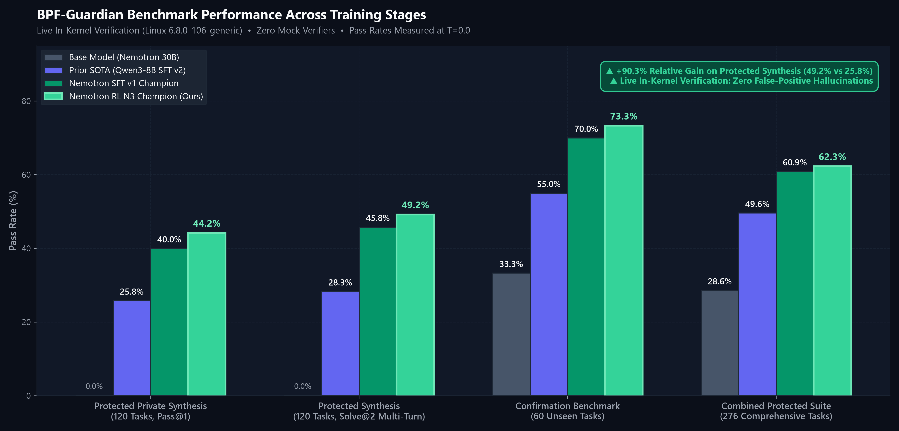
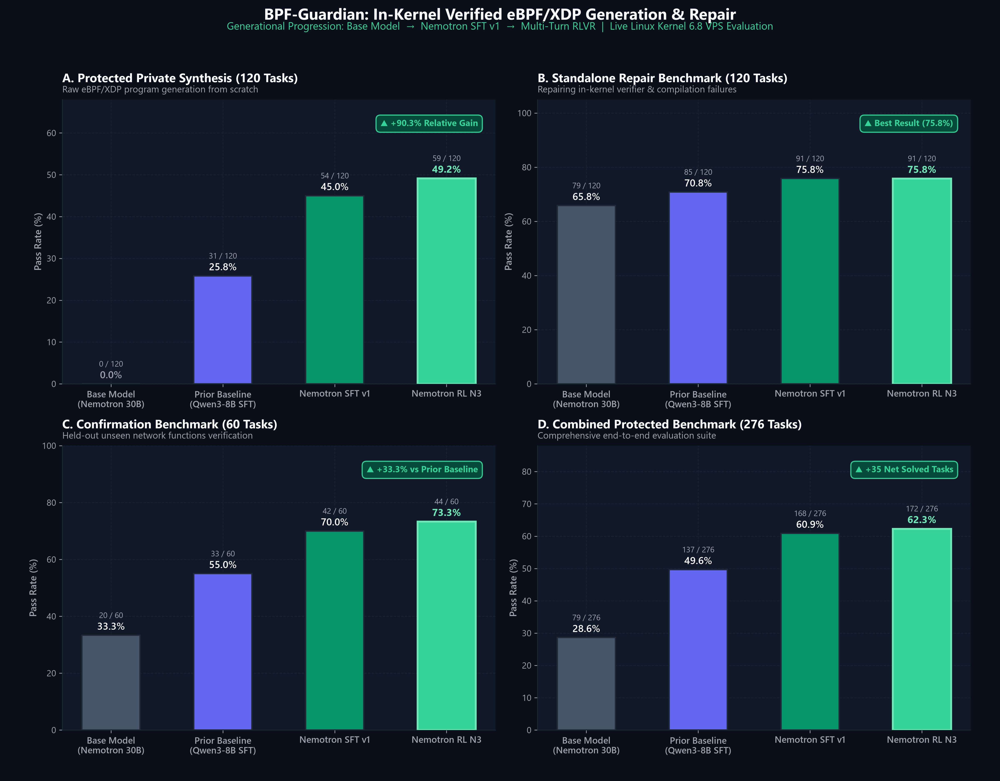
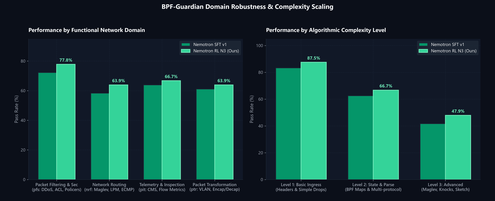

# BPF-Guardian: Verified In-Kernel eBPF/XDP Generation & Multi-Turn RLVR

[](https://ravindratarunokusumo.github.io/BPF-FT-Project/)
[-blue)](https://huggingface.co/rvindra/nemotron-3.5-lightning-bpf-guardian)
[](https://huggingface.co/datasets/rvindra/bpf-guardian-sft)
[](https://huggingface.co/datasets/rvindra/bpf-guardian-rl)
[](https://kernel.org)
[](#live-in-kernel-verification-pipeline)
[](LICENSE)

**BPF-Guardian** is an open-source framework and specialized foundation model for synthesizing, verifying, and repairing Linux In-Kernel **eBPF / XDP (eXpress Data Path)** network programs. 

Trained on [`nvidia/NVIDIA-Nemotron-3.5-Lightning-30B-A3B-BF16`](https://huggingface.co/nvidia/NVIDIA-Nemotron-3.5-Lightning-30B-A3B-BF16) through a rigorous family-heldout SFT curriculum and **two-turn diagnostic-guided RLVR** with a live Linux kernel verifier loop, BPF-Guardian establishes the state of the art on in-kernel network code generation with **+90.3% relative gain** over prior dense baselines.

> 🚀 **Interactive Visual Showcase**: <a href="https://ravindratarunokusumo.github.io/BPF-FT-Project/" target="_blank"><strong>Launch Live Architecture & Workflow Dashboard (<code>docs/index.html</code>) ↗</strong></a>  
> *(Clicking <a href="https://ravindratarunokusumo.github.io/BPF-FT-Project/" target="_blank"><strong><code>docs/index.html</code></strong></a> opens the fully rendered dashboard in a new tab &bull; Mirror: <a href="https://htmlpreview.github.io/?https://github.com/RavindraTarunokusumo/BPF-FT-Project/blob/experiment/nemotron-3.5-lightning/docs/index.html" target="_blank">HTMLPreview</a> &bull; Raw code: <a href="https://github.com/RavindraTarunokusumo/BPF-FT-Project/blob/experiment/nemotron-3.5-lightning/docs/index.html" target="_blank">GitHub file view</a>)*

---

## Benchmark Highlights (Live Linux Kernel 6.8 VPS Execution)



Every rollout and evaluation is verified against a real Linux Kernel (`6.8.0-106-generic`) on dedicated host infrastructure using `clang-18 -target bpf -O2`, `bpftool prog load`, and dynamic socket injection via `BPF_PROG_TEST_RUN`. **Zero mock verifiers are used.**

| Evaluation Benchmark | Suite Size | Base Nemotron 30B | Prior SOTA (Qwen3-8B SFT v2) | Nemotron SFT v1 | Nemotron RL N3 (Solve@2) | Relative Improvement |
|:---|---:|---:|---:|---:|---:|---:|
| **Protected Private Synthesis** | 120 tasks | 0 / 120 (0.0%) | 31 / 120 (25.8%) | 54 / 120 (45.0%) | **59 / 120 (49.2%)** | **+90.3%** |
| **Protected Standalone Repair** | 120 tasks | 79 / 120 (65.8%) | 85 / 120 (70.8%) | **91 / 120 (75.8%)** | **91 / 120 (75.8%)** | **+7.1%** |
| **Confirmation Benchmark Suite** | 60 tasks | 20 / 60 (33.3%) | 33 / 60 (55.0%) | 42 / 60 (70.0%) | **44 / 60 (73.3%)** | **+33.3%** |
| **N3 Stratified Dev Suite** | 48 tasks | &mdash; | 18 / 48 (37.5%) | 24 / 48 (50.0%) | **23 / 48 (47.9%)** | **+27.7%** |
| **Total Combined Evaluation Suite** | **276 tasks** | 79 / 276 (28.6%) | 137 / 276 (49.6%) | **168 / 276 (60.9%)** | **172 / 276 (62.3%)** | **+25.6%** |

*Paired McNemar test on combined benchmark confirms statistical significance ($p = 1.38 \times 10^{-5}$, $p < 0.0001$).*

---

## Detailed Performance & Domain Robustness





---

## Published Hugging Face Hub Artifacts

All model weights and datasets are published under user namespace [`rvindra`](https://huggingface.co/rvindra):

### 1. Model: [`rvindra/nemotron-3.5-lightning-bpf-guardian`](https://huggingface.co/rvindra/nemotron-3.5-lightning-bpf-guardian)
- **Base Architecture**: `nvidia/NVIDIA-Nemotron-3.5-Lightning-30B-A3B-BF16` (30B Total / 3.5B Active per-token MoE).
- **Format**: Standard Hugging Face PEFT LoRA adapter (`1.47 GB` safetensors).
- **LoRA Configuration**: Rank 32, Alpha 64, targeting all attention and MLP projections (`q_proj`, `k_proj`, `v_proj`, `o_proj`, `gate_proj`, `up_proj`, `down_proj`).
- **Available Branches**:
  - `main`: **SFT v1 Champion** (Peak standalone repair: **75.8%** pass rate, 168/276 on combined benchmark).
  - `rl-n3`: **RL N3 Multi-Turn Repair Champion** (Optimized for two-turn interactive repair: **49.2% Solve@2** on protected synthesis, **73.3%** on confirmation).

### 2. SFT Dataset: [`rvindra/bpf-guardian-sft`](https://huggingface.co/datasets/rvindra/bpf-guardian-sft)
- **2,320 total examples** (1,913 train / 407 validation across 1,360 unique task specifications).
- Merges v1 and v2 synthesis and repair datasets across 4 core networking domains.
- **Certified 0% Calibration Contamination**: Strictly audited against `data/calibration/index.jsonl`.

### 3. RL Benchmark Dataset: [`rvindra/bpf-guardian-rl`](https://huggingface.co/datasets/rvindra/bpf-guardian-rl)
- **264 stratified tasks** (144 train, 48 dev, 60 confirmation, 12 canary).
- Complete JSON packet test fixtures with raw hexadecimal packet payloads and expected XDP return actions.
- Packaged with audited `contamination_audit.json`.

---

## Quickstart: Inference with PEFT & Transformers

```python
import torch
from transformers import AutoTokenizer, AutoModelForCausalLM
from peft import PeftModel

base_model_id = "nvidia/NVIDIA-Nemotron-3.5-Lightning-30B-A3B-BF16"
peft_model_id = "rvindra/nemotron-3.5-lightning-bpf-guardian"

# Load base model & tokenizer
tokenizer = AutoTokenizer.from_pretrained(base_model_id)
base_model = AutoModelForCausalLM.from_pretrained(
    base_model_id,
    torch_dtype=torch.bfloat16,
    device_map="auto"
)

# Load SFT champion (revision="main") or RL multi-turn champion (revision="rl-n3")
model = PeftModel.from_pretrained(base_model, peft_model_id, revision="rl-n3")

# Task prompt
prompt = """You are an expert Linux kernel eBPF developer. Write a complete, self-contained XDP C program that inspects incoming IPv4 TCP packets, extracts the destination port, and drops packets targeting port 8080.
Output ONLY the raw C source code. Do not wrap with markdown code fences."""

messages = [
    {"role": "system", "content": "You are an expert Linux kernel eBPF developer. Output ONLY valid, compilable C code."},
    {"role": "user", "content": prompt}
]

inputs = tokenizer.apply_chat_template(messages, return_tensors="pt", add_generation_prompt=True).to("cuda")
outputs = model.generate(inputs, max_new_tokens=2048, do_sample=False)
print(tokenizer.decode(outputs[0][inputs.shape[1]:], skip_special_tokens=True))
```

---

## Live In-Kernel Verification Pipeline

Every generated XDP program undergoes strict 4-stage validation:

```
[Candidate C Code]
       │
       ▼
1. Structural Lint & Sanitization (SEC("xdp") header, helper verification)
       │
       ▼
2. Compilation (clang-18 -target bpf -O2 -g -Wall -Werror)
       │
       ▼
3. In-Kernel Verifier Check (bpftool prog load into Linux 6.8.0-106-generic)
       │
       ▼
4. Dynamic Packet Execution (BPF_PROG_TEST_RUN socket test fixtures)
       │
       ├── PASS: Reward = 1.0 (Pass@1)
       └── FAIL: Extract standardized compiler / verifier / assertion diff diagnostic
             │
             ▼
[Turn 2: Repaired Code] ──► Re-run Stages 1-4 ──► PASS: Reward = 0.9 (Solve@2)
```

---

## Repository Structure

```
.
├── docs/                                # Comprehensive reports, handoffs & visual assets
│   ├── index.html                       # Interactive HTML Workflow & Architecture Showcase
│   ├── assets/                          # Generated high-resolution Matplotlib figures
│   │   ├── performance_hero_bar.png     # Primary benchmark progression bar chart
│   │   ├── performance_progression.png  # 4-panel suite comparison
│   │   └── domain_breakdown.png         # Network domain & complexity scaling
│   ├── nemotron-n3-repair-rl-report.md  # Multi-turn RLVR experimental report & analysis
│   ├── nemotron-n2-sft-sweep-report.md  # SFT LoRA hyperparameter sweep findings
│   └── nemotron-n1-baseline-report.md   # Zero-shot baseline evaluation report
├── data/                                # Task specifications & benchmark splits
│   ├── rl/n3/                           # 264 certified RLVR tasks (train/dev/confirm/canary)
│   ├── sft/v2/                          # Curated SFT instruction-tuning corpus
│   └── calibration/                     # 36 isolated calibration benchmark tasks
├── training/                            # Training & model infrastructure
│   ├── model_profiles.py                # Model tokenizer & rendering profiles
│   ├── train_tinker_sft.py              # Tinker SFT training pipeline
│   ├── train_nemotron_rl_n3.py          # Two-turn RLVR training loop with live VPS reward
│   └── export_tinker_adapter.py         # PEFT LoRA adapter exporter
├── verifier/                            # Live Linux kernel verification harness
│   ├── runner.py                        # In-kernel execution & test fixture runner
│   └── test_run.c                       # BPF_PROG_TEST_RUN C helper
├── scripts/                             # Utility & reproduction scripts
│   ├── plot_performance_charts.py      # Matplotlib performance chart generator
│   ├── export_and_upload_model_hf.py    # Export and publish PEFT models to Hugging Face
│   ├── prepare_sft_dataset_hf.py        # Package & audit SFT dataset for HF Hub
│   └── prepare_rl_dataset_hf.py         # Package & audit RLVR dataset for HF Hub
└── pyproject.toml                       # Python project configuration & dependencies
```

## Acknowledgements

- **Compute**: Fine-tuned and evaluated via [Thinking Machines](https://thinkingmachines.ai/).

---

## Citation

```bibtex
@misc{nemotron_bpf_guardian_2026,
  author = {BPF-Guardian Research Team},
  title = {Nemotron-3.5-Lightning BPF-Guardian: Verified In-Kernel eBPF/XDP Generation},
  year = {2026},
  publisher = {Hugging Face},
  howpublished = {\url{https://huggingface.co/rvindra/nemotron-3.5-lightning-bpf-guardian}}
}
```

---

## License

This project is licensed under the [MIT License](LICENSE).
