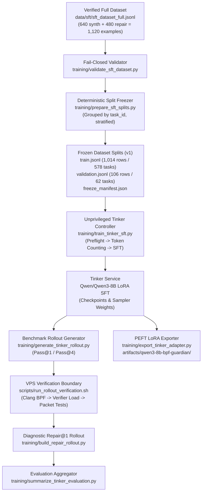

# BPF-Guardian: Tinker SFT, Dataset Freeze, Rollout, Verification, and Export Pipeline

This directory implements the complete, reproducible end-to-end Supervised Fine-Tuning (SFT) pipeline for **BPF-Guardian** (`RavindraTarunokusumo/BPF-FT-Project`) using Tinker's managed LoRA training infrastructure and the existing Linux VPS kernel verification harness.

---

## 1. Architecture Overview



---

## 2. Environment Setup

The pipeline uses `uv` for reproducible, lockfile-pinned dependencies.

### Installation

```bash
# Install uv if not present
curl -LsSf https://astral.sh/uv/install.sh | sh

# Sync locked environment
uv sync --frozen
```

### Resolved & Pinned Dependencies
- `tinker==0.26.1`
- `tinker-cookbook==0.5.5`
- `datasets==5.0.1`
- `chz==0.4.0`
- `pytest==9.1.1`

### Credential Handling
Export your `TINKER_API_KEY` into your shell environment. **Never hardcode, log, print, commit, or persist API keys in code or artifacts.**

```bash
export TINKER_API_KEY="your-tinker-api-key-here"
```

---

## 3. Dataset Validation

Validates every non-empty line of `data/sft/sft_dataset_full.jsonl` under strict fail-closed constraints.

### Validation Rules
1. **Schema**: `example_id`, `task_id`, `category`, `difficulty`, `template_family`, `example_type`, and valid `messages`.
2. **Completion Contract**: Raw C source code only. No markdown fences (`` ``` ``), no preamble/postscript prose.
3. **BPF Markers**: Must contain `#include`, `SEC(...)`, XDP entry point (`int xdp...` / `XDP_`), and license declaration (`_license` or `LICENSE`).
4. **Negative Safety**: Rejects any `FAULT:`, `TODO:`, `FIXME:`, or truncation markers in gold targets.
5. **Repair Records**: User context contains faulty code and diagnostics; assistant contains only the verified gold code.
6. **Token Length**: Validates actual rendered length using official `Qwen/Qwen3-8B` tokenizer and `qwen3_disable_thinking` renderer.

### Command

```bash
uv run python training/validate_sft_dataset.py \
    --dataset data/sft/sft_dataset_full.jsonl \
    --max-length 4096
```

---

## 4. Dataset Freeze and Splitting

Splits `sft_dataset_full.jsonl` into deterministic, reproducible splits under `data/sft/frozen/v1/`.

### Key Guarantees
- **Task Grouping**: Synthesis and all repair examples for a given `task_id` remain strictly co-located in the same split.
- **Stratification**: Tasks are stratified across `(category, difficulty, template_family)`.
- **Zero Leakage**: Guarantees 0% task overlap between train and validation.
- **Benchmark Isolation**: Completely excludes all 36 calibration benchmark task IDs (`data/calibration/index.jsonl`).
- **Immutability Protection**: Refuses to overwrite existing frozen splits if file hashes differ.

### Command

```bash
uv run python training/prepare_sft_splits.py \
    --dataset data/sft/sft_dataset_full.jsonl \
    --output-dir data/sft/frozen/v1 \
    --calibration-index data/calibration/index.jsonl \
    --seed 42 \
    --val-ratio 0.10
```

### Frozen Split Artifacts
- `data/sft/frozen/v1/train.jsonl` (1,014 examples across 578 tasks)
- `data/sft/frozen/v1/validation.jsonl` (106 examples across 62 tasks)
- `data/sft/frozen/v1/freeze_manifest.json` (cryptographic SHA-256 hashes & distributions)
- `data/sft/frozen/v1/split_report.md` (human-readable report)

---

## 5. Tinker SFT Training Workflow

### 5.1 Unpaid Preflight (Dry Run)

Always run preflight before starting a paid run. This validates manifest hashes, tokenizes the full dataset, verifies Tinker server connection, calculates total tokens, and estimates exact cost without spending credits.

```bash
uv run python training/train_tinker_sft.py \
    --train-file data/sft/frozen/v1/train.jsonl \
    --validation-file data/sft/frozen/v1/validation.jsonl \
    --manifest-file data/sft/frozen/v1/freeze_manifest.json \
    --preflight-only
```

### 5.2 Paid SFT Launch

To initiate the remote GPU fine-tuning on Tinker, specify `--confirm-paid-run`.

```bash
uv run python training/train_tinker_sft.py \
    --train-file data/sft/frozen/v1/train.jsonl \
    --validation-file data/sft/frozen/v1/validation.jsonl \
    --manifest-file data/sft/frozen/v1/freeze_manifest.json \
    --learning-rate 2e-4 \
    --lr-schedule linear \
    --num-epochs 3 \
    --lora-rank 32 \
    --batch-size 32 \
    --max-length 4096 \
    --save-every 20 \
    --eval-every 10 \
    --confirm-paid-run
```

Or run via shell wrapper:

```bash
./scripts/run_tinker_sft.sh --confirm-paid-run
```

### 5.3 Small Test Run with Budget Limit (< $0.50)

To perform a fast, small test run on Tinker within a strict budget limit (e.g. max 5 steps, max budget $0.50):

```bash
uv run python training/train_tinker_sft.py \
    --train-file data/sft/frozen/v1/train.jsonl \
    --validation-file data/sft/frozen/v1/validation.jsonl \
    --max-steps 5 \
    --num-epochs 1 \
    --max-budget-usd 0.50 \
    --confirm-paid-run
```

### 5.4 Checkpoint Resume

If training was interrupted, resume directly from the latest training-state checkpoint:

```bash
uv run python training/train_tinker_sft.py \
    --load-checkpoint-path "tinker://<session-id>:train:0/state_checkpoints/step_<N>" \
    --confirm-paid-run
```

---

## 6. Benchmark Rollout Generation

Generates candidate programs against the 36-task calibration benchmark (`data/calibration/index.jsonl`).

### 6.1 Base Model Rollout (Pass@1)

```bash
uv run python training/generate_tinker_rollout.py \
    --benchmark-index data/calibration/index.jsonl \
    --output-dir runs/evaluation/qwen3-8b-base/rollout-001 \
    --model-name Qwen/Qwen3-8B \
    --num-samples 1 \
    --temperature 0.0
```

### 6.2 Fine-Tuned Model Rollout (Pass@1)

```bash
uv run python training/generate_tinker_rollout.py \
    --benchmark-index data/calibration/index.jsonl \
    --output-dir runs/evaluation/qwen3-8b-sft/rollout-001 \
    --sampler-checkpoint "tinker://<session-id>:train:0/sampler_weights/final" \
    --num-samples 1 \
    --temperature 0.0
```

### 6.3 Sampled Pass@4 (T=0.7)

```bash
uv run python training/generate_tinker_rollout.py \
    --benchmark-index data/calibration/index.jsonl \
    --output-dir runs/evaluation/qwen3-8b-sft/rollout-001-pass4 \
    --sampler-checkpoint "tinker://<session-id>:train:0/sampler_weights/final" \
    --num-samples 4 \
    --temperature 0.7
```

### 6.4 Offline Mock Mode (No Token Usage)

```bash
uv run python training/generate_tinker_rollout.py \
    --benchmark-index data/calibration/index.jsonl \
    --output-dir runs/evaluation/mock-qwen3-8b/rollout-001 \
    --mock
```

---

## 7. VPS Verification Boundary

The Tinker controller operates as an unprivileged process. Live kernel loading (`bpftool prog load`) and packet tests (`bpftool prog run`) execute strictly on the Linux VPS worker.

### Running Verification on Linux VPS

```bash
sudo ./scripts/run_rollout_verification.sh runs/evaluation/qwen3-8b-sft/rollout-001
```

### Importing & Aggregating Results Locally

```bash
uv run python training/import_verifier_results.py \
    --rollout-dir runs/evaluation/qwen3-8b-sft/rollout-001
```

---

## 8. Diagnostic-Guided Repair@1 Rollout

For any candidate that fails compilation, kernel verifier loading, or packet testing, construct a diagnostic repair prompt and generate a 1-turn repair attempt:

```bash
uv run python training/build_repair_rollout.py \
    --synthesis-rollout runs/evaluation/qwen3-8b-sft/rollout-001 \
    --output-dir runs/evaluation/qwen3-8b-sft/rollout-001-repair1 \
    --sampler-checkpoint "tinker://<session-id>:train:0/sampler_weights/final"
```

Verify the repaired candidates on the VPS:

```bash
sudo ./scripts/run_rollout_verification.sh runs/evaluation/qwen3-8b-sft/rollout-001-repair1
```

---

## 9. Evaluation Summary & Baseline Comparison

Aggregates synthesis and repair verification results, comparing them against the calibration baseline:

```bash
uv run python training/summarize_tinker_evaluation.py \
    --base-results runs/evaluation/qwen3-8b-base/rollout-001/verification/results.jsonl \
    --sft-results runs/evaluation/qwen3-8b-sft/rollout-001/verification/results.jsonl \
    --sft-repair-results runs/evaluation/qwen3-8b-sft/rollout-001-repair1/verification/results.jsonl \
    --output runs/evaluation/final_evaluation_summary.md
```

### Baseline References
- **Zero-shot Pass@1**: 3/36 = 8.3%
- **Repair@1 Recovery**: 3/33 = 9.1%
- **Post-Repair Total Pass**: 6/36 = 16.7%

---

## 10. PEFT LoRA Adapter Export

Converts the Tinker sampler checkpoint into standard Hugging Face PEFT format (`adapter_config.json` and `adapter_model.safetensors`):

```bash
uv run python training/export_tinker_adapter.py \
    --checkpoint "tinker://<session-id>:train:0/sampler_weights/final" \
    --output-dir artifacts/qwen3-8b-bpf-guardian \
    --base-model Qwen/Qwen3-8B \
    --lora-rank 32
```

---

## 11. Cost Estimation and Pricing Formulas

Current Tinker pricing for `Qwen/Qwen3-8B`:
- **Training**: $0.44 per million tokens
- **Prefill / Evaluation**: $0.195 per million tokens ($0.039 cached)
- **Sampling / Generation**: $0.60 per million tokens
- **Checkpoint Storage**: $0.10 per GB / month

### SFT Training Token Breakdown (v1 Dataset)
- **Train Examples**: 1,014
- **Tokens per Epoch**: 1,122,597 tokens
- **Total Training Tokens (3 Epochs)**: 3,367,791 tokens
- **Estimated SFT Optimizer Cost**: $1.48 USD
- **Validation Evaluation Cost (10 Evals)**: ~$0.22 USD
- **Total Expected Training Cost**: **~$1.70 USD**
